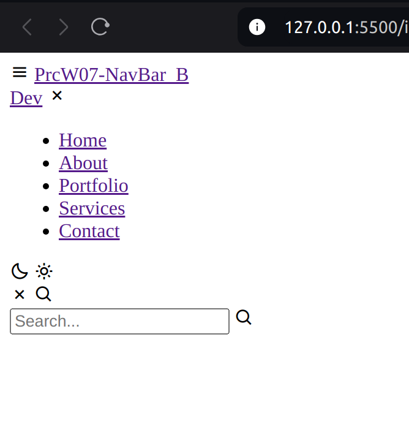
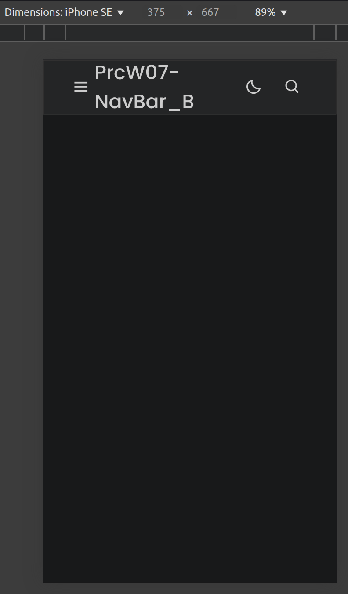
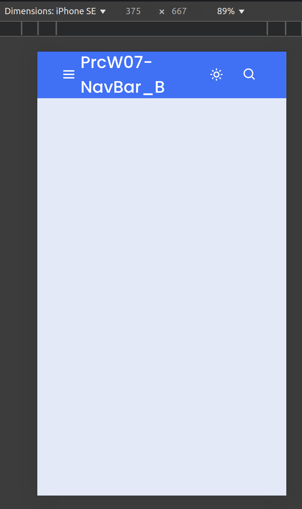
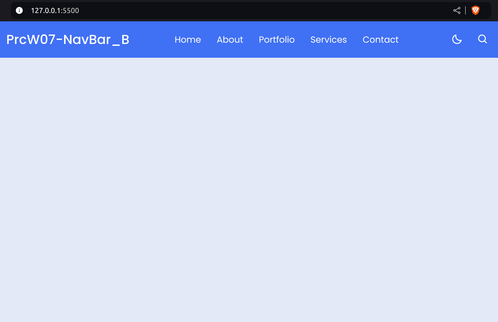

 
#  Responsive Navbar
Responsive NavBar with dark/light effect

##  Branch dev1

Here we have structured the Navbar skeleton 

***

##  Branches dev2 and dev3

These branches contain the style and script for the Navbar and toggle effects respectively
***

## Branch joint

Here we have combined the Navbar skeleton, style and script to create a fully functional Navbar


***

## Branch  QA  and Main

Here we have added the testing and deployment scripts respectively
We also slightly modified the  base color for the dark effect



***

#  Code analysis
 
##  HTML File

We defined a navigation bar with a search box that can be toggled on and off using the provided icons. The search box we included contains an input field and a search icon.
Lastly we linked our base code to the script file, which is resonsible for handling the search functionality, such as toggling the search box and processing search queries.
***

## css file
1- We defined global variables for consistent design elements throughout the stylesheet

2- Then the basic layout and appearance of the body element, including its height and background was set.

3- We continue with the dark mode effects, defining the set of styles that can be applied to the body element to switch to a dark mode theme, overriding the basic body styles.

4- Lastly we styled the navigation bar, including its position, size, and background color, to create a fixed navigation bar at the top of the page.
***

## script file
1- We first defined a function to toggle the search box on and off.
2- Then we defined a function to handle search queries, which is called whenever the user submits a
search query.
3- We also defined a function to handle the dark mode toggle.
***

-  **Code section title x**
>
```css
Put your code here exactly as it is.
```

> Use this text block to describe **relevant facts**.
***


***
